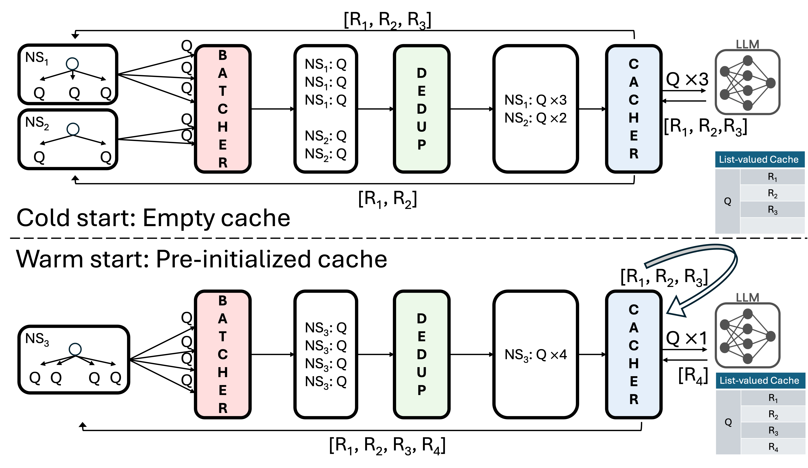
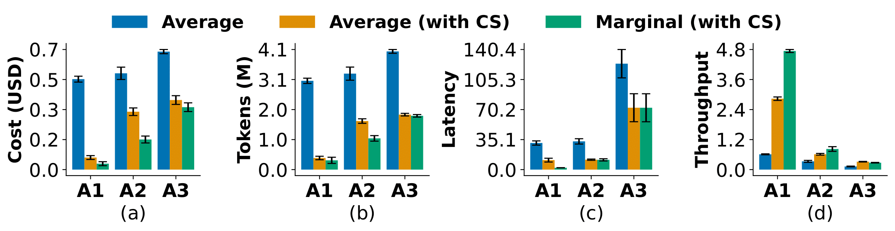

# CacheSaver
*Client-Side Framework for Efficient & Reproducible LLM Inference*


[](https://pypi.org/project/cachesaver/)
[](https://openreview.net/forum?id=Ve2r5Bap1Q)


---

## What is CacheSaver?

**CacheSaver** is a lightweight client-side library that wraps existing LLM inference clients to make them:

- **Efficient** — repeated prompts and sub-problems are automatically cached and reused.  
- **Reproducible** — identical inputs yield identical outputs across runs.  
- **Compatible** — works with any LLM client (OpenAI, HuggingFace, vLLM, etc.) without modifying your code.

This repository accompanies our paper *“CacheSaver: Client-Side Caching for Efficient and Reproducible LLM Inference”*,  accepted at **EMNLP 2025**, and the related [project blog](https://au-clan.github.io/2025-06-21-cachesaver/).


---

## 💡 Why CacheSaver?

### ⚙️ The Problem

- 🧮 LLM **inference dominates cost and energy consumption** sometimes up to **90% of the model’s total lifecycle**.  
- 🤔 Many reasoning workflows (e.g., multi-agent, Tree-of-Thoughts, self-refinement) **reuse sub-problems** that are recomputed each time.  
- 🎲 **Reproducibility** is tricky because most LLM APIs don’t support deterministic seeding.

### 🚀 Our Solution

**CacheSaver** tackles these challenges with a **client-side cache and namespace system**:

- 🔌 Wrap your existing client: no model or server changes required.  
- 🧩 Introduce **namespaces** that act like “seeds”:  
  - Within a namespace → random sampling stays IID.  
  - Across namespaces → identical prompts yield identical results.  
- ♻️ Cache intermediate reasoning steps to **reuse** them across runs.

✨ **Result:** Faster, cheaper, and reproducible inference — all with minimal effort.


---

## Key Features

- 🚀 **Plug-and-Play:** One-line integration.
- 🔁 **Cache & Reuse:** Avoid recomputation of repeated sub-problems.  
- 🧩 **Namespace Control:** Fine-grained reproducibility without losing randomness.  
- ⚙️ **Universal Compatibility:** Works with any LLM API or local model.  
- 🧠 **Lightweight:** No server-side code, minimal memory overhead.

---
## Installation

Install the latest release with its minimal dependencies:

```zsh
pip install cachesaver
```

You can also install the latest version from the source:

```bash
# Install with test dependencies (Will also publish in pypi soon).
git clone https://github.com/au-clan/cachesaver-core.git
cd cachesaver-core
pip install -e ".[test]"

# Run tests to verify everything works
pytest test/ -v
```

---

## Quickstart

```python
from cachesaver.models.openai import AsyncOpenAI

client = AsyncOpenAI(batch_size=2)

resp = await client.chat.completions.create(
    model="gpt-4.1-nano",
    messages=[
        {"role": "user", "content": "What's the capital of France?"}
    ]
)
```

For more use cases and examples of CacheSaver in action, please see the following [Jupyter notebook](https://github.com/au-clan/cachesaver/blob/main/examples.ipynb).
---

## Performance



We tested **CacheSaver** on common LLM research tasks such as hyperparameter tuning, ablation studies, and benchmarking, where many prompts or reasoning steps repeat across runs. By caching and reusing identical sub-queries on the client side, CacheSaver avoided redundant computations and achieved substantial savings, making experiments up to **6× cheaper and 7× faster** for hyperparameter tuning, **2.5× cheaper** for ablation studies, and about **2× cheaper** for benchmarking, all **without changing model behavior or code**.

---

## Feedback

We welcome all forms of feedback! Please open an issue for bugs, questions, or suggestions. Your input helps us improve CacheSaver, address common challenges efficiently, and build a stronger, more collaborative community.

---

## Citation

Official BibTeX to be announced with EMNLP 2025.